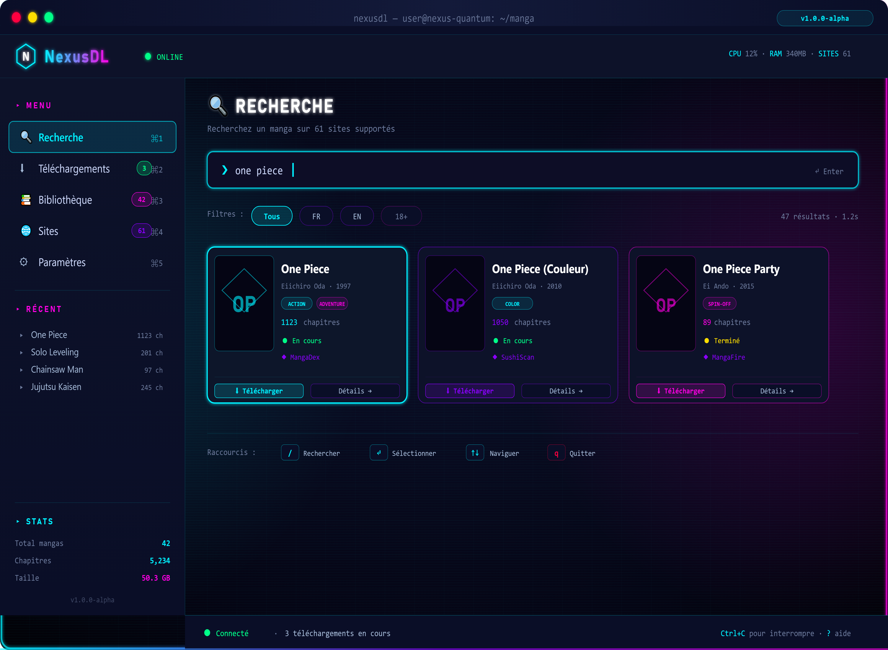
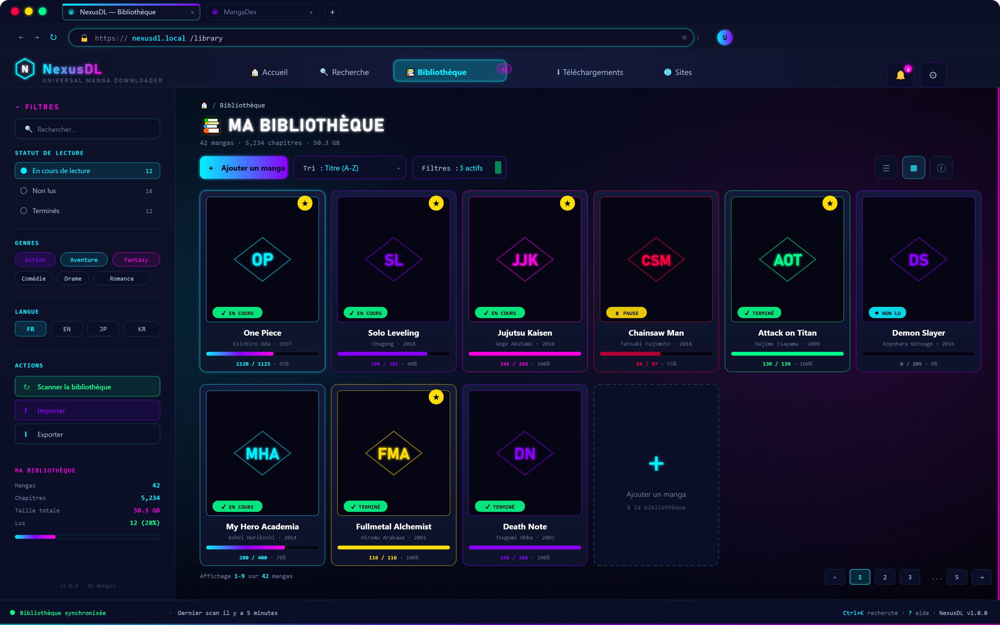
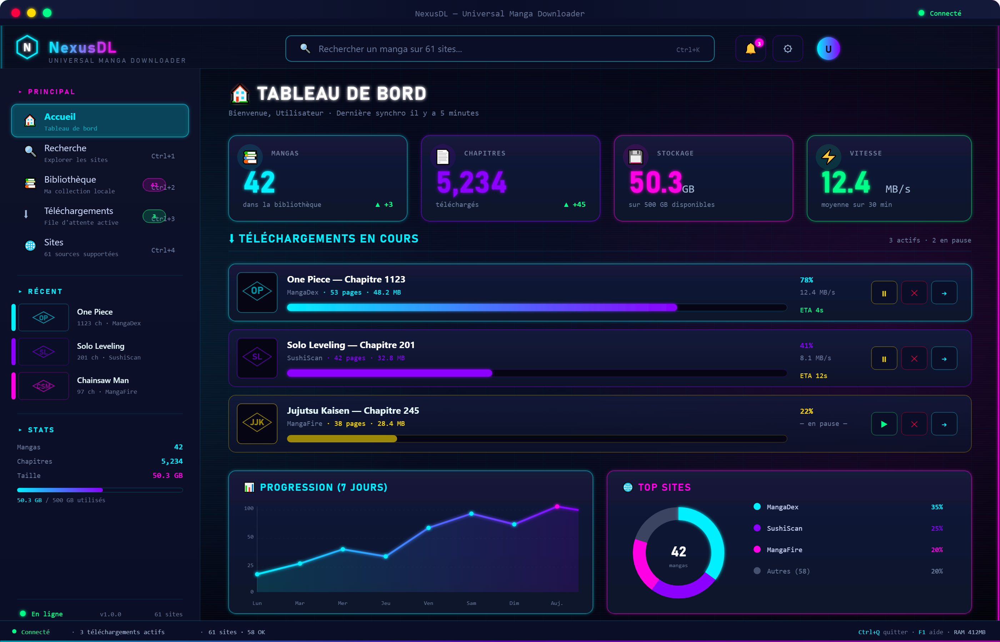

<!--
  ╔═══════════════════════════════════════════════════════════════════════════╗
  ║                                                                           ║
  ║      ███╗   ██╗███████╗██╗  ██╗██╗   ██╗███████╗██████╗ ██╗               ║
  ║      ████╗  ██║██╔════╝╚██╗██╔╝██║   ██║██╔════╝██╔══██╗██║               ║
  ║      ██╔██╗ ██║█████╗   ╚███╔╝ ██║   ██║███████╗██║  ██║██║               ║
  ║      ██║╚██╗██║██╔══╝   ██╔██╗ ██║   ██║╚════██║██║  ██║██║               ║
  ║      ██║ ╚████║███████╗██╔╝ ██╗╚██████╔╝███████║██████╔╝███████╗          ║
  ║      ╚═╝  ╚═══╝╚══════╝╚═╝  ╚═╝ ╚═════╝ ╚══════╝╚═════╝ ╚══════╝          ║
  ║                                                                           ║
  ║            🚀 Universal Manga & Webtoon Downloader 🚀                     ║
  ║                                                                           ║
  ╚═══════════════════════════════════════════════════════════════════════════╝
-->

<div align="center">

# 🌌 NexusDL

### *Universal Manga & Webtoon Downloader*

**Téléchargez vos mangas, webtoons, comics et doujinshis depuis plus de 60 sources — dans un seul outil.**

[](https://www.python.org/)
[](LICENSE)
[](CHANGELOG.md)
[](docs/source/installation/)
[](CONTRIBUTING.md)
[](https://github.com/astral-sh/ruff)

[🚀 Installation](#-installation) •
[📖 Documentation](#-documentation) •
[🌐 Sites supportés](#-sites-supportés) •
[💻 Utilisation](#-utilisation) •
[🤝 Contribuer](#-contribuer)

</div>

---

## 📖 À propos

**NexusDL** est une plateforme open-source, multi-sites et multi-plateformes permettant de télécharger, organiser et lire vos mangas, webtoons, comics et doujinshis préférés. Né de la refonte complète du projet **SushiDL**, NexusDL reprend son héritage tout en adoptant une architecture moderne, modulaire et extensible.

Conçu pour les **power users**, les **collectionneurs** et les **self-hosters**, NexusDL se distingue par :

- 🎯 **Une architecture hexagonale** propre et testable
- ⚡ **Un moteur de téléchargement asynchrone** ultra-performant
- 🔌 **Un système de plugins** pour étendre facilement les fonctionnalités
- 🎨 **Trois interfaces** : CLI moderne, Web élégante, Desktop native
- 📦 **Multi-format d'export** : ZIP, CBZ, CBR, PDF, dossier brut
- 🛡️ **Bypass Cloudflare** intégré (Playwright + FlareSolverr)
- 🌍 **Support multi-langues** : 🇫🇷 FR, 🇬🇧 EN, 🇰🇷 KR, 🇯🇵 JP, 🔞 ADULT

> ⚠️ **Avertissement légal** : NexusDL est un outil technique destiné à un usage personnel. Vous êtes seul responsable de l'utilisation que vous faites des contenus téléchargés. Respectez les lois de votre pays et les conditions d'utilisation des sites sources. Les mainteneurs déclinent toute responsabilité quant à l'usage qui pourrait en être fait.

---

## ✨ Fonctionnalités

<table>
<tr>
<td width="50%" valign="top">

### 🎯 Core
- ✅ **60+ sites supportés** (FR, EN, KR, Adult)
- ✅ **Recherche multi-sites** en parallèle
- ✅ **Téléchargement asynchrone** ultra-rapide
- ✅ **File d'attente prioritaire** avec pause/reprise
- ✅ **Reprise automatique** des téléchargements interrompus
- ✅ **Déduplication** par hash SHA-256
- ✅ **Rate limiting** intelligent par site

</td>
<td width="50%" valign="top">

### 🎨 Interfaces
- ✅ **CLI moderne** basée sur Textual (TUI)
- ✅ **Interface Web** FastAPI + Next.js
- ✅ **GUI Desktop** CustomTkinter
- ✅ **WebSocket** pour progression temps réel
- ✅ **Thème clair/sombre** automatique
- ✅ **Support multi-langues** (i18n)

</td>
</tr>
<tr>
<td width="50%" valign="top">

### 📦 Formats & Médias
- ✅ **CBZ** (Comic Book ZIP) — standard
- ✅ **CBR** (Comic Book RAR)
- ✅ **ZIP** classique
- ✅ **PDF** via img2pdf
- ✅ **Dossier brut** (images séparées)
- ✅ **ComicInfo.xml** (ComicRack standard)
- ✅ **Conversion** webp → jpg, avif → png

</td>
<td width="50%" valign="top">

### 🛡️ Sécurité & Robustesse
- ✅ **Bypass Cloudflare** (Playwright, FlareSolverr)
- ✅ **Cookies chiffrés** au repos
- ✅ **Rotation User-Agent** réaliste
- ✅ **Support proxys** (HTTP, SOCKS5)
- ✅ **Retry avec backoff** exponentiel
- ✅ **Health check** automatique des sites

</td>
</tr>
<tr>
<td width="50%" valign="top">

### 📚 Bibliothèque
- ✅ **BDD SQLite** locale
- ✅ **Recherche FTS5** instantanée
- ✅ **Métadonnées** complètes (auteur, genres, année)
- ✅ **Suivi de lecture** (progression, marque-pages)
- ✅ **Scan automatique** de dossier
- ✅ **Export/Import** de bibliothèque

</td>
<td width="50%" valign="top">

### 🔧 Extensibilité
- ✅ **Système de plugins** communautaire
- ✅ **Parsers modulaires** par site
- ✅ **Mixins réutilisables** (Madara, MangaThemesia, FoolSlide)
- ✅ **API REST** documentée (OpenAPI)
- ✅ **Hooks** à tous les niveaux
- ✅ **Tests** complets (unit, integration, e2e)

</td>
</tr>
</table>

---

## 📸 Aperçu

<div align="center">

### 💻 Interface CLI (Textual)



*Recherche multi-sites, gestion des téléchargements, bibliothèque locale — tout dans votre terminal.*

### 🌐 Interface Web (Next.js)



*Interface moderne, responsive, accessible depuis n'importe quel navigateur.*

### 🖥️ Interface Desktop (CustomTkinter)



*Application native légère pour Windows, Linux et macOS.*

</div>

---

## 🌐 Sites supportés

NexusDL supporte **plus de 60 sites** répartis par langue et type de contenu.

### 🇫🇷 Sites Français

| Site | Domaine | Statut | Notes |
|------|---------|:------:|-------|
| SushiScan | `sushiscan.fr` / `sushiscan.net` | ✅ | Support complet |
| Mangas Origines | `mangas-origines.com` / `.fr` | ✅ | Support complet |
| Hentai Origines | `hentai-origines.com` | 🔞 | Adulte |
| ToonFR | `toonfr.com` | ✅ | Support complet |
| OrtegaScans | `ortegascans.fr` / `.com` | ✅ | Support complet |
| Anime-Scans | `anime-scans.com` | ✅ | Support complet |
| Phenix Scans | `phenix-scans.co` | ✅ | Support complet |
| Poseidon Scans | `poseidon-scans.net` | ✅ | Support complet |
| Raijin Scans | `raijin-scans.fr` | ✅ | Support complet |
| RimuScan | `rimuscan.fr` | ✅ | Support complet |
| Blossom Scans | `blossom-scans.com` | ✅ | Support complet |
| EpsilonScan | `epsilonscan.to` | ✅ | Support complet |
| Genkan Scans | `genkan-scans.com` | ✅ | Support complet |
| NekoHouse | `nekohouse.fr` | ✅ | Support complet |
| Shinra Scans | `shinra-scans.fr` | ✅ | Support complet |
| Taisei Scans | `taisei-scans.com` | ✅ | Support complet |
| Fandub Scans | `fandub-scans.com` | ✅ | Support complet |
| Karma Scans | `karma-scans.com` | ✅ | Support complet |
| Urano Scans | `urano-scans.fr` | ✅ | Support complet |
| Xanadu Scans | `xanadu-scans.fr` | ✅ | Support complet |
| Scan-Manga | `scan-manga.com` | ✅ | Cloudflare |
| CrunchyScan | `crunchyscan.fr` / `.org` | ✅ | Cloudflare |

### 🇬🇧 Sites Anglais

| Site | Domaine | Statut | Notes |
|------|---------|:------:|-------|
| MangaDex | `api.mangadex.org` | ⭐ | **API officielle** |
| MangaKakalot | `mangakakalot.com` | ✅ | Support complet |
| Bato.to | `bato.to` | ✅ | Support complet |
| Comick | `comick.io` | ✅ | API |
| Asura Scans | `asurascans.com` | ✅ | MangaThemesia |
| Flame Scans | `flamescans.org` | ✅ | MangaThemesia |
| Reaper Scans | `reaperscans.com` | ✅ | MangaThemesia |
| Luminous Scans | `luminousscans.com` | ✅ | Support complet |
| Void Scans | `void-scans.com` | ✅ | Support complet |
| TCB Scans | `tcbscans.com` | ✅ | Support complet |
| MangaSee123 | `mangasee123.com` | ✅ | Support complet |
| Galaxy Scans | `galaxy-scans.com` | ✅ | Support complet |
| Zenith Scans | `zenith-scans.com` | ✅ | Support complet |
| Leviathan Scans | `leviathanscans.com` | ✅ | Support complet |
| Disaster Scans | `disasterscans.com` | ✅ | Support complet |
| KireiCake | `kireicake.com` | ✅ | Support complet |
| Scylla Scans | `scyllascans.com` | ✅ | Support complet |
| ToonGod | `toongod.org` | ✅ | Support complet |
| MangaFire | `mangafire.to` | ⭐ | Recommandé |
| MangaBuddy | `mangabuddy.com` | ⭐ | Recommandé |
| Toonily | `toonily.com` | ⭐ | Recommandé |

### 🇰🇷 Manhwa (Coréen)

| Site | Domaine | Statut | Notes |
|------|---------|:------:|-------|
| ManhwaClub | `manhwaclub.net` | ✅ | Support complet |
| Manhwa-Raw | `manhwa-raw.com` | ✅ | Support complet |

### 🔞 Sites Adultes (18+)

> ⚠️ **Ces sources sont désactivées par défaut.** Activez-les via `config.yaml` (`adult: true`) ou le flag `--adult` en CLI.

| Site | Domaine | Statut | Notes |
|------|---------|:------:|-------|
| nHentai | `nhentai.net` | 🔞 | API non officielle |
| HentaiZone | `hentaizone.xyz` | 🔞 | Playwright |
| Pururin | `pururin.com` | 🔞 | Playwright |
| Scan-Hentai | `scan-hentai.net` | 🔞 | Cloudflare |
| X-Manga | `x-manga.net` / `.org` | 🔞 | Support complet |

### 🤖 Sources API & Spéciales

| Source | Type | Statut |
|--------|------|:------:|
| MangaDex | API REST officielle | ⭐ |
| Comick | API REST | ✅ |
| nHentai | API non officielle | 🔞 |
| FlareSolverr | Proxy Cloudflare | ✅ |

---

## 🚀 Installation

### Prérequis

- **Python 3.12+** (obligatoire)
- **pip** ou **uv** (recommandé)
- **Git**
- **Playwright** (pour les sites JS)
- *Optionnel* : **Docker** pour le déploiement

### Installation rapide (uv — recommandé)

```bash
# Installer uv si pas déjà présent
curl -LsSf https://astral.sh/uv/install.sh | sh

# Cloner le repo
git clone https://github.com/NEXUS-QUANTUM/nexusdl.git
cd nexusdl

# Installer les dépendances
uv sync

# Installer les navigateurs Playwright
uv run playwright install chromium

# Lancer NexusDL
uv run nexusdl --help
```

### Installation via pip

```bash
pip install nexusdl
playwright install chromium
nexusdl --help
```

### Installation depuis les sources (pip classique)

```bash
git clone https://github.com/NEXUS-QUANTUM/nexusdl.git
cd nexusdl

python -m venv .venv
source .venv/bin/activate  # Windows : .venv\Scripts\activate

pip install -e ".[all]"
playwright install chromium
```

### Installation via Docker

```bash
# CLI uniquement
docker run -it --rm \
  -v $(pwd)/downloads:/downloads \
  -v $(pwd)/config:/config \
  nexusquantum/nexusdl:latest

# Interface web
docker compose up -d web
# → http://localhost:8000
```

---

## 💻 Utilisation

### 🖥️ Interface CLI

```bash
# Lancer l'interface interactive (Textual)
nexusdl

# Rechercher un manga
nexusdl search "One Piece"

# Télécharger un manga complet
nexusdl download "https://mangadex.org/title/..." --format cbz

# Télécharger un chapitre spécifique
nexusdl download "URL" --chapters 1-10

# Télécharger depuis plusieurs sites
nexusdl search "Solo Leveling" --sites mangadex,asurascans

# Lister les sites supportés
nexusdl sites --language fr

# Gérer la configuration
nexusdl config set download.format cbz
nexusdl config set download.path ~/Manga

# Mettre à jour les cookies Cloudflare
nexusdl cookies refresh sushiscan
```

### 🌐 Interface Web

```bash
# Démarrer le backend
nexusdl web --host 0.0.0.0 --port 8000

# Ou via Docker Compose
docker compose up -d web
```

Puis ouvrez **http://localhost:8000** dans votre navigateur.

### 🖥️ Interface Desktop

```bash
nexusdl gui
```

### 🐍 Utilisation comme bibliothèque Python

```python
import asyncio
from pathlib import Path
from nexusdl import NexusDL

async def main():
    async with NexusDL() as nexus:
        # Recherche multi-sites
        results = await nexus.search("One Piece", languages=["fr", "en"])

        # Téléchargement d'un manga
        manga = await nexus.get_manga(results[0].url)

        async for result in nexus.download(
            manga,
            dest=Path("~/Manga").expanduser(),
            fmt="cbz",
            chapters=manga.chapters[:5],  # 5 premiers chapitres
        ):
            print(f"✅ {result.chapter.title} → {result.output_path}")

asyncio.run(main())
```

---

## ⚙️ Configuration

NexusDL utilise un fichier de configuration YAML situé par défaut dans :
- **Linux/macOS** : `~/.config/nexusdl/config.yaml`
- **Windows** : `%APPDATA%\nexusdl\config.yaml`
- **Docker** : `/config/config.yaml`

### Exemple de configuration complète

```yaml
# ~/.config/nexusdl/config.yaml

general:
  language: fr                    # Langue de l'interface (fr, en, es, de)
  theme: dark                     # Thème (light, dark, auto)
  log_level: INFO                 # TRACE, DEBUG, INFO, WARNING, ERROR

download:
  path: ~/Manga                   # Dossier de destination
  format: cbz                     # zip, cbz, cbr, pdf, folder
  overwrite: false                # Écraser si existe
  max_concurrent_tasks: 3         # Téléchargements simultanés
  max_concurrent_pages: 8         # Pages simultanées par chapitre
  timeout: 30                     # Timeout HTTP (secondes)
  retry_attempts: 3               # Nombre de retries
  retry_backoff: 2.0              # Facteur de backoff exponentiel

network:
  proxy: null                     # ex: "socks5://127.0.0.1:1080"
  user_agent_rotation: true       # Rotation automatique
  http2: true                     # Activer HTTP/2

cloudflare:
  use_playwright: true            # Utiliser Playwright pour bypass
  use_flaresolverr: false         # Utiliser FlareSolverr
  flaresolverr_url: "http://localhost:8191/v1"

cookies:
  encryption: true                # Chiffrer les cookies au repos
  auto_refresh: true              # Refresh automatique Cloudflare

library:
  enabled: true                   # Activer la bibliothèque locale
  database: ~/.local/share/nexusdl/library.db
  scan_on_startup: false          # Scanner au démarrage

adult:
  enabled: false                  # Activer les sites adultes (18+)
  require_confirmation: true      # Demander confirmation

sites:
  disabled: []                    # Sites désactivés (ex: ["nhentai"])
  overrides:                      # Overrides par site
    mangadex:
      rate_limit: 5.0
      max_concurrent: 10
    hentaizone:
      requires_playwright: true
      rate_limit: 1.0
```

---

## 📦 Formats de sortie

| Format | Extension | Description | Compatibilité |
|--------|-----------|-------------|---------------|
| **CBZ** | `.cbz` | ZIP renommé, standard comics | ⭐ Komga, Kavita, YACReader, Tachiyomi |
| **CBR** | `.cbr` | RAR renommé | CDisplayEx, YACReader |
| **ZIP** | `.zip` | Archive classique | Universel |
| **PDF** | `.pdf` | Document PDF | Universel |
| **Folder** | `/` | Images brutes | Tous |

Tous les formats CBZ/CBR incluent un fichier **`ComicInfo.xml`** conforme au standard **ComicRack** (métadonnées, auteur, genres, année, etc.), idéal pour les bibliothèques auto-hébergées.

### Structure de sortie

```
~/Manga/
└── One Piece/
    ├── One Piece - Chapitre 001.cbz
    ├── One Piece - Chapitre 002.cbz
    ├── One Piece - Chapitre 003.cbz
    └── ...
```

---

## 🏗️ Architecture

NexusDL suit une **architecture hexagonale** (ports & adapters) stricte :

```
┌────────────────────────────────────────────────────────────┐
│                     INTERFACES                             │
│      CLI (Textual) │ Web (FastAPI+Next) │ GUI (CTk)        │
└────────────────────────┬───────────────────────────────────┘
                         │
┌────────────────────────▼───────────────────────────────────┐
│                       CORE                                 │
│  Downloader │ Registry │ Session │ Packaging │ Library     │
└────────────────────────┬───────────────────────────────────┘
                         │
┌────────────────────────▼───────────────────────────────────┐
│                     PARSERS                                │
│   FR │ EN │ KR │ ADULT │ + mixins (Madara, MangaThemesia)  │
└────────────────────────────────────────────────────────────┘
```

**Règles strictes** :
- `core/` ne dépend **jamais** de `interfaces/` ni de `parsers/`
- `parsers/` ne dépend **jamais** de `interfaces/`
- `interfaces/` peut dépendre de tout
- **Async-first** : tout I/O est asynchrone
- **Type-safe** : mypy strict, 100% typé

📚 **[Documentation architecture complète →](docs/source/development/architecture.md)**

---

## 🔌 Ajouter un nouveau site

Créer un nouveau parser est simple grâce au système de mixins :

```python
# src/nexusdl/parsers/fr/mon_site.py
from nexusdl.parsers.base import BaseParser
from nexusdl.parsers.mixins import MadaraMixin
from nexusdl.core.models import Manga, Chapter, Page, SearchResult

class MonSiteParser(MadaraMixin, BaseParser):
    """Parser pour mon-site.fr (thème WordPress Madara)."""

    site_id = "mon_site"
    language = "fr"
    adult = False

    base_url = "https://mon-site.fr"

    # Le mixin Madara fournit search(), get_manga(), get_chapters()
    # Il suffit d'implémenter get_pages() si non-standard :

    async def get_pages(self, chapter: Chapter) -> list[Page]:
        html = await self.session.get_html(chapter.url)
        soup = self.parse_html(html)
        # ... extraction des URLs d'images
        return [Page(index=i, url=url, filename=f"{i:03d}.jpg")
                for i, url in enumerate(image_urls)]
```

Puis enregistrez-le dans `sites.yaml` :

```yaml
sites:
  mon_site:
    name: "Mon Site"
    domains: ["https://mon-site.fr"]
    parser_class: "nexusdl.parsers.fr.mon_site:MonSiteParser"
    language: fr
    adult: false
    capabilities:
      supports_search: true
      supports_chapters: true
      max_concurrent_downloads: 4
      rate_limit_per_second: 2.0
```

📚 **[Guide complet d'ajout de site →](docs/source/development/adding_sites.md)**

---

## 🗺️ Roadmap

### ✅ Version 1.0 (en développement)
- [x] Architecture core complète
- [x] Parsers FR, EN, KR, Adult
- [x] Interface CLI (Textual)
- [x] Interface Web (FastAPI + Next.js)
- [x] Interface GUI (CustomTkinter)
- [x] Formats ZIP, CBZ, CBR, PDF
- [ ] Système de plugins
- [ ] Bibliothèque locale + FTS5
- [ ] Support multi-langues i18n

### 🔜 Version 1.1
- [ ] Synchronisation cloud (WebDAV, S3, Nextcloud)
- [ ] Lecteur intégré (web + GUI)
- [ ] Notifications (Discord, Telegram, ntfy)
- [ ] Support Torrent (optionnel)
- [ ] Application mobile (React Native)

### 🔮 Version 2.0
- [ ] Backend distribué (multi-nœuds)
- [ ] Marketplace de plugins
- [ ] Recommandations IA
- [ ] Traduction automatique (OCR + DeepL)
- [ ] Support des anime

---

## 🤝 Contribuer

Les contributions sont **chaleureusement bienvenues** ! Que vous soyez développeur, designer, traducteur ou simple utilisateur, il y a mille façons d'aider.

### Façons de contribuer

- 🐛 **Signaler un bug** → [Ouvrir une issue](https://github.com/NEXUS-QUANTUM/nexusdl/issues/new?template=bug_report.md)
- 💡 **Proposer une fonctionnalité** → [Ouvrir une issue](https://github.com/NEXUS-QUANTUM/nexusdl/issues/new?template=feature_request.md)
- 🌐 **Ajouter un site** → [Template dédié](https://github.com/NEXUS-QUANTUM/nexusdl/issues/new?template=new_site.md)
- 📝 **Améliorer la doc** → PR directe
- 🌍 **Traduire l'interface** → `src/nexusdl/data/translations/`
- 💻 **Coder** → Voir le [guide de contribution](CONTRIBUTING.md)

### Processus

```bash
# 1. Fork le projet
# 2. Clone votre fork
git clone https://github.com/VOTRE_USERNAME/nexusdl.git
cd nexusdl

# 3. Créer une branche
git checkout -b feature/ma-super-feature

# 4. Installer les dépendances de dev
uv sync --all-extras

# 5. Coder (avec pre-commit activé)
pre-commit install

# 6. Commit (format conventionnel)
git commit -m "feat(parsers): add mangafire support"

# 7. Push & PR
git push origin feature/ma-super-feature
```

📚 **[Guide de contribution complet →](CONTRIBUTING.md)**

---

## 📖 Documentation

| Document | Description |
|----------|-------------|
| [📘 Installation](docs/source/installation/) | Guide d'installation détaillé par OS |
| [📗 Utilisation CLI](docs/source/usage/cli.md) | Toutes les commandes CLI |
| [📗 Utilisation Web](docs/source/usage/web.md) | Guide de l'interface web |
| [📗 Utilisation GUI](docs/source/usage/gui.md) | Guide de l'interface desktop |
| [📙 Configuration](docs/source/usage/configuration.md) | Toutes les options |
| [📙 Formats](docs/source/usage/formats.md) | Détail des formats de sortie |
| [📕 Architecture](docs/source/development/architecture.md) | Architecture interne |
| [📕 Ajouter un site](docs/source/development/adding_sites.md) | Guide parser |
| [📕 Plugins](docs/source/development/plugins.md) | Développement de plugins |
| [📓 API REST](docs/source/api/rest.md) | Endpoints HTTP |
| [📓 API Python](docs/source/api/python.md) | Utilisation comme lib |

---

## ❓ FAQ

<details>
<summary><b>NexusDL est-il légal ?</b></summary>

NexusDL est un **outil technique** de téléchargement, comparable à un navigateur web. Il ne stocke ni ne distribue aucun contenu. L'utilisateur est seul responsable de l'usage qu'il en fait. Nous vous recommandons de vérifier la légalité dans votre juridiction et de respecter les droits d'auteur.

</details>

<details>
<summary><b>Pourquoi les téléchargements Cloudflare échouent ?</b></summary>

Certains sites (Scan-Manga, HentaiZone, etc.) utilisent Cloudflare Turnstile. Assurez-vous que :
1. Playwright est installé : `playwright install chromium`
2. Les cookies `cf_clearance` sont à jour : `nexusdl cookies refresh <site>`
3. `cloudflare.use_playwright: true` dans la config

</details>

<details>
<summary><b>Puis-je utiliser NexusDL sur un NAS ?</b></summary>

Oui ! Le mode Docker est parfait pour ça. Utilisez `docker-compose.yml` avec un volume pour `/downloads` et `/config`. Compatible Synology, QNAP, Unraid, TrueNAS.

</details>

<details>
<summary><b>Comment activer les sites adultes ?</b></summary>

Dans `config.yaml` : `adult.enabled: true`
En CLI : `nexusdl --adult search "..."`

⚠️ Ces sites sont désactivés par défaut pour des raisons évidentes.

</details>

<details>
<summary><b>Puis-je héberger NexusDL pour plusieurs utilisateurs ?</b></summary>

Oui, le mode Web supporte l'authentification multi-utilisateurs (JWT). Chaque utilisateur a sa propre bibliothèque et ses propres cookies. Voir `docs/source/usage/web.md`.

</details>

---

## 🐛 Support & Communauté

- 💬 **Discord** : [Rejoindre le serveur](https://discord.gg/NEXUS-QUANTUM)
- 🐛 **Issues** : [GitHub Issues](https://github.com/NEXUS-QUANTUM/nexusdl/issues)
- 💡 **Discussions** : [GitHub Discussions](https://github.com/NEXUS-QUANTUM/nexusdl/discussions)
- 📧 **Email** : `nexus.quantum@protonmail.com`
- 🌐 **Site web** : [nexus-quantum.dev](https://nexus-quantum.dev)

---

## 🌟 Remerciements

NexusDL n'existerait pas sans :

- **SushiDL** — le projet original dont NexusDL est la refonte
- **Tachiyomi / Mihon** — inspiration pour l'UX
- **Suwayomi** — inspiration pour le mode serveur
- **Hakuneko** — inspiration pour le support multi-sites
- **MangaDex** — pour leur API exceptionnelle et gratuite
- **Tous les contributeurs** qui rendent ce projet vivant ❤️

Et tous les projets open-source utilisés :
`httpx`, `pydantic`, `fastapi`, `textual`, `playwright`, `next.js`, `react`...

---

## 📜 Licence

NexusDL est distribué sous licence **GNU General Public License v3.0**.

```
Copyright (C) 2026 NEXUS-QUANTUM

This program is free software: you can redistribute it and/or modify
it under the terms of the GNU General Public License as published by
the Free Software Foundation, either version 3 of the License, or
(at your option) any later version.

This program is distributed in the hope that it will be useful,
but WITHOUT ANY WARRANTY; without even the implied warranty of
MERCHANTABILITY or FITNESS FOR A PARTICULAR PURPOSE. See the
GNU General Public License for more details.
```

Voir [LICENSE](LICENSE) pour le texte complet.

---

<div align="center">

## 🌌 Rejoignez la communauté NEXUS-QUANTUM

**Tous nos projets, tous nos réseaux — un seul handle : `@NEXUS-QUANTUM`**

[](https://github.com/NEXUS-QUANTUM)
[](https://x.com/NEXUS-QUANTUM)
[](https://discord.gg/NEXUS-QUANTUM)
[](https://t.me/NEXUS-QUANTUM)
[](https://reddit.com/u/NEXUS-QUANTUM)
[](https://youtube.com/@NEXUS-QUANTUM)
[](https://instagram.com/NEXUS-QUANTUM)
[](https://tiktok.com/@NEXUS-QUANTUM)
[](https://twitch.tv/NEXUS-QUANTUM)
[](https://mastodon.social/@NEXUS-QUANTUM)
[](https://bsky.app/profile/NEXUS-QUANTUM)
[](https://linkedin.com/in/NEXUS-QUANTUM)
[](https://patreon.com/NEXUS-QUANTUM)
[](https://ko-fi.com/NEXUS-QUANTUM)
[](mailto:nexus.quantum@protonmail.com)
[](https://nexus-quantum.dev)

---

### ⭐ Si NexusDL vous est utile, laissez une étoile sur GitHub ! ⭐

**Fait avec ❤️ par [NEXUS-QUANTUM](https://github.com/NEXUS-QUANTUM) et la communauté.**

*« Le savoir doit être libre, accessible et universel. »*


</div>
```
