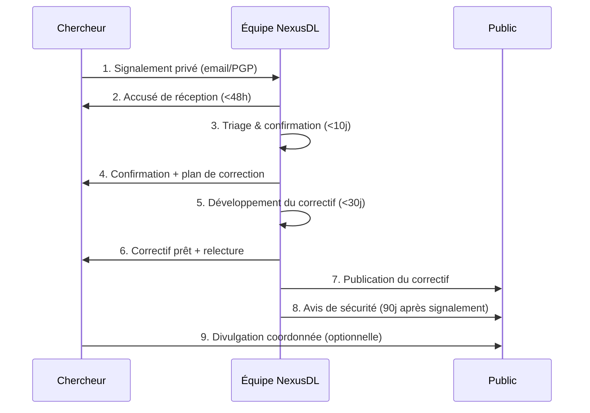

Voici le **`SECURITY.md` complet, professionnel et prêt à l'emploi** pour NexusDL, adapté à un projet open-source de téléchargement multi-sites avec support adulte, plugins et plusieurs interfaces.

```markdown
# 🔒 Security Policy — NexusDL

<div align="center">

**Politique de sécurité et de divulgation responsable des vulnérabilités**

[](SECURITY.md)
[](#-clé-pgp)
[](SECURITY.md)
[](LICENSE)

</div>

---

## 📖 Sommaire

- [Versions supportées](#-versions-supportées)
- [Signaler une vulnérabilité](#-signaler-une-vulnérabilité)
- [Ce qui constitue une vulnérabilité](#-ce-qui-constitue-une-vulnérabilité)
- [Ce qui n'en constitue PAS](#-ce-qui-nen-constitue-pas)
- [Notre engagement](#-notre-engagement)
- [Processus de divulgation](#-processus-de-divulgation)
- [Récompenses](#-récompenses)
- [Clé PGP](#-clé-pgp)
- [Bonnes pratiques utilisateur](#-bonnes-pratiques-utilisateur)
- [Sécurité du projet](#-sécurité-du-projet)
- [Contact](#-contact)

---

## 📊 Versions supportées

Nous appliquons une politique de **support actif** sur les versions récentes. Seules les versions listées ci-dessous reçoivent des correctifs de sécurité.

| Version | Statut | Support sécurité | Fin de vie |
|:-------:|:------:|:----------------:|:----------:|
| **1.x** (branche `main`) | 🟢 Stable | ✅ **Actif** | TBD |
| **1.0.x** | 🟢 Stable | ✅ **Actif** | Version précédente + 6 mois |
| **0.x** (legacy) | 🔴 Obsolète | ❌ Non supporté | Terminé |
| **SushiDL** (projet d'origine) | 🔴 Déprécié | ❌ Non supporté | Migrer vers NexusDL |

> ⚠️ **Important** : Si vous utilisez une version obsolète, **mettez à jour immédiatement** :
>
> ```bash
> # Via uv (recommandé)
> uv sync --upgrade
>
> # Via pip
> pip install --upgrade nexusdl
>
> # Via Docker
> docker pull nexusquantum/nexusdl:latest
> ```

---

## 🚨 Signaler une vulnérabilité

### 📧 Canal officiel (recommandé)

**Envoyez un email chiffré à :**

```
security@nexus-quantum.dev
```

**OU** via GitHub Security Advisories :

👉 **[Créer un rapport privé](https://github.com/NEXUS-QUANTUM/nexusdl/security/advisories/new)**

### 📝 Informations à inclure

Pour nous aider à traiter votre rapport rapidement, merci d'inclure :

```markdown
## Résumé
Description concise de la vulnérabilité (1-2 phrases).

## Type de vulnérabilité
- [ ] RCE (Remote Code Execution)
- [ ] Injection (SQL, commande, template, ...)
- [ ] SSRF / XXE / CSRF
- [ ] Déni de service (DoS)
- [ ] Élévation de privilèges
- [ ] Exposition de données sensibles
- [ ] Contournement d'authentification
- [ ] Path traversal / Zip slip
- [ ] Dépendance compromise (supply chain)
- [ ] Autre : _______

## Composants affectés
- Version(s) de NexusDL : ex. 1.0.3
- Interface(s) : CLI / Web / GUI / API / Parser
- Système(s) : Linux / Windows / macOS / Docker
- Module : ex. `nexusdl.core.session.http_session`

## Étapes de reproduction
1. ...
2. ...
3. ...

## Preuve de concept (PoC)
Code, requête HTTP, capture d'écran, ou toute preuve exploitable.

## Impact
Description de l'impact réel ou potentiel :
- Confidentialité : ...
- Intégrité : ...
- Disponibilité : ...

## Correctif suggéré (optionnel)
Si vous avez une idée de correction, décrivez-la.

## CVSS (optionnel)
Vecteur CVSS 3.1 si vous l'avez calculé : `CVSS:3.1/AV:N/AC:L/...`

## Attribution
- Nom / pseudonyme (si vous souhaitez être crédité)
- Contact (si vous souhaitez être recontacté)
- PGP key ID (si chiffré)

## Divulgation
- [ ] J'accepte d'attendre la divulgation coordonnée (90 jours max)
- [ ] Je souhaite divulguer publiquement immédiatement (déconseillé)
```

### 🕒 Délais de réponse

Nous nous engageons à respecter les délais suivants :

| Étape | Délai maximum |
|-------|:-------------:|
| **Accusé de réception** | 48 heures |
| **Évaluation initiale (triage)** | 5 jours ouvrés |
| **Confirmation de la vulnérabilité** | 10 jours ouvrés |
| **Correctif développé** | 30 jours (critique : 7 jours) |
| **Publication du correctif** | 90 jours après le signalement |
| **Divulgation publique** | Après publication du correctif |

> ⏱️ **Si vous ne recevez pas d'accusé de réception sous 72 heures**, renvoyez votre email ou contactez-nous via un autre canal (voir [Contact](#-contact)).

---

## ✅ Ce qui constitue une vulnérabilité

Nous prenons au sérieux **tout problème** qui pourrait compromettre la sécurité, la vie privée ou l'intégrité de nos utilisateurs. Exemples acceptés :

### 🔥 Vulnérabilités critiques

- **RCE** (Remote Code Execution) via l'un des composants
- **Injection de code** dans les parsers ou l'interface web
- **Contournement d'authentification** (JWT, sessions web)
- **Exposition de secrets** (cookies, tokens, mots de passe)
- **Path traversal** dans les téléchargements ou l'empaquetage
- **Zip slip** dans les packages CBZ/CBR/ZIP
- **SSRF** via les URLs des sites
- **XXE** dans le parsing XML (ComicInfo.xml)
- **Dépendance compromise** dans notre supply chain

### 🔐 Vulnérabilités moyennes

- **CSRF** sur les endpoints web
- **XSS** dans l'interface web
- **DoS** (épuisement mémoire, boucle infinie, ...)
- **Fuite d'informations** dans les logs
- **Bypass du rate limiting**
- **Contournement de la désactivation du contenu adulte**
- **Fuite de cookies chiffrés**
- **Élévation de privilèges** locaux

### 🛡️ Vulnérabilités de moindre sévérité

- **Exposition de chemins** dans les messages d'erreur
- **Clickjacking** sur l'interface web
- **Manque de headers de sécurité** (CSP, HSTS, ...)
- **Désérialisation non sécurisée** (pickle, yaml.load)
- **Utilisation de fonctions cryptographiques obsolètes**

---

## ❌ Ce qui n'en constitue PAS

Les éléments suivants **ne sont PAS considérés** comme des vulnérabilités :

- ❌ **Le téléchargement de contenus protégés par le droit d'auteur** — NexusDL est un outil technique, l'usage est de la responsabilité de l'utilisateur
- ❌ **Le support de sites adultes (18+)** — C'est une fonctionnalité assumée et documentée
- ❌ **Le contournement de Cloudflare** — C'est une fonctionnalité technique légitime (utilisée par de nombreux projets open-source)
- ❌ **Les sites eux-mêmes** — Nous ne contrôlons pas les sites sources
- ❌ **Les contenus téléchargés** — Non filtrés, responsabilité utilisateur
- ❌ **Les plugins tiers** — Hors périmètre (sauf si vulnérabilité dans notre loader)
- ❌ **Les rapports générés automatiquement par des scanners** sans analyse manuelle
- ❌ **Les "vulnérabilités" théoriques** sans PoC fonctionnel
- ❌ **Les DoS via configuration volontairement absurde** (ex. `max_concurrent_pages: 100000`)
- ❌ **Les problèmes de performance** en dehors d'un vecteur d'attaque réel
- ❌ **L'absence de support sur une ancienne version** — voir [Versions supportées](#-versions-supportées)

> 💡 **Si vous n'êtes pas sûr**, envoyez-nous quand même. Nous évaluerons avec sérieux.

---

## 🤝 Notre engagement

Nous nous engageons à :

1. ✅ **Répondre rapidement** à tout signalement (48h max)
2. ✅ **Traiter chaque rapport avec sérieux et confidentialité**
3. ✅ **Vous tenir informé** de l'avancement du correctif
4. ✅ **Vous créditer** dans le rapport de sécurité (si vous le souhaitez)
5. ✅ **Ne pas engager de poursuites** contre les chercheurs de bonne foi
6. ✅ **Publier un avis de sécurité** détaillé après correction
7. ✅ **Corriger les vulnérabilités critiques en priorité absolue**
8. ✅ **Communiquer ouvertement** sur les incidents

### 🛡️ Safe Harbor

Nous garantissons un **safe harbor** aux chercheurs en sécurité qui :

- Respectent cette politique
- Agissent de bonne foi
- Ne causent pas de dommages aux utilisateurs
- Ne divulguent pas publiquement avant la période convenue
- Ne s'introduisent pas dans les comptes d'autres utilisateurs
- N'utilisent pas les vulnérabilités à des fins malveillantes
- Ne se livrent pas à de l'ingénierie sociale

**Nous ne poursuivrons PAS** les chercheurs agissant dans ce cadre.

---

## 🔄 Processus de divulgation

Notre processus suit les standards de l'industrie (**divulgation coordonnée** ou **responsible disclosure**) :



### 📅 Chronologie typique

| J+x | Étape |
|:---:|-------|
| **J+0** | Signalement reçu |
| **J+2** | Accusé de réception |
| **J+7** | Triage initial terminé |
| **J+10** | Vulnérabilité confirmée |
| **J+30** | Correctif développé et testé |
| **J+45** | Version patchée publiée |
| **J+90** | Avis de sécurité public |

**Cas critique (CVSS ≥ 9.0)** : délais réduits de **50 %** — correctif publié sous 15 jours.

### 📢 Avis de sécurité

Chaque vulnérabilité confirmée fait l'objet d'un **GitHub Security Advisory** :

- **CVE ID** demandé si applicable
- **CVSS 3.1** calculé
- **Description technique** détaillée
- **Versions affectées** et **patchées**
- **Contournements** si disponibles
- **Crédits** aux chercheurs (si consentement)

Consultez les avis publiés :
👉 **[GitHub Security Advisories](https://github.com/NEXUS-QUANTUM/nexusdl/security/advisories)**

---

## 🏆 Récompenses

NexusDL est un projet **communautaire bénévole** sans financement. Nous ne pouvons pas offrir de **bug bounty monétaire** — mais nous offrons :

| Récompense | Détail |
|------------|--------|
| 🏅 **Crédit public** | Votre nom/pseudo dans l'avis de sécurité + `SECURITY_HALL_OF_FAME.md` |
| 🎖️ **Badge "Security Researcher"** | Sur notre Discord (rôle permanent) |
| 📢 **Mention sur les réseaux** | Post Twitter/Mastodon lors de la divulgation |
| 🎁 **Swag** | Stickers/mugs NexusDL (si budget disponible) |
| 💝 **Sponsorship** | Mise en avant de votre profil GitHub |
| 🚀 **Contributor status** | Accès en avant-première aux bêtas |

### 🏛️ Security Hall of Fame

Les chercheurs ayant contribué sont listés dans [`SECURITY_HALL_OF_FAME.md`](SECURITY_HALL_OF_FAME.md) :

| Chercheur | Vulnérabilité | Version patchée |
|-----------|--------------|:---------------:|
| *En attente du premier rapport* | — | — |

---

## 🔐 Clé PGP

Pour les signalements **sensibles**, chiffrez votre email avec notre clé publique :

```
-----BEGIN PGP PUBLIC KEY BLOCK-----

[Clé PGP à générer et publier ici]

Empreinte : XXXX XXXX XXXX XXXX XXXX  XXXX XXXX XXXX XXXX XXXX
ID        : 0xXXXXXXXXXXXXXXXX
Email     : security@nexus-quantum.dev
Expire    : 2028-01-01

-----END PGP PUBLIC KEY BLOCK-----
```

**Récupérer la clé :**

```bash
# Depuis les serveurs de clés
gpg --keyserver keys.openpgp.org --recv-keys <FINGERPRINT>

# Depuis notre site
curl -sSL https://nexus-quantum.dev/pgp/security.asc | gpg --import

# Vérifier l'empreinte
gpg --fingerprint security@nexus-quantum.dev
```

> 🔑 **Vérifiez TOUJOURS l'empreinte** sur au moins 2 canaux différents (site web + GitHub + Twitter) avant d'envoyer des informations sensibles.

---

## 👤 Bonnes pratiques utilisateur

Pour utiliser NexusDL en toute sécurité :

### 🔐 Configuration

- ✅ **Changez le mot de passe par défaut** de l'interface web
- ✅ **Activez le HTTPS** en production (via reverse proxy)
- ✅ **Limitez l'accès réseau** (localhost ou VPN uniquement)
- ✅ **Utilisez des secrets forts** (`SECRET_KEY`, JWT secret)
- ✅ **Chiffrez vos cookies** (`cookies.encryption: true`)
- ✅ **N'exposez jamais** l'interface web directement sur Internet sans protection

### 🐳 Docker

- ✅ **Utilisez un utilisateur non-root** dans les conteneurs
- ✅ **Ne montez pas `/var/run/docker.sock`** dans le conteneur
- ✅ **Limitez les ressources** (CPU, RAM)
- ✅ **Utilisez des volumes dédiés** pour `/config` et `/downloads`
- ✅ **Mettez à jour régulièrement** : `docker pull nexusquantum/nexusdl:latest`

### 📦 Dépendances

- ✅ **Utilisez `uv.lock`** pour des installations reproductibles
- ✅ **Vérifiez les CVE** : `just security`
- ✅ **Mettez à jour régulièrement** : `just update`
- ✅ **N'installez que des plugins de confiance** (le système de plugins exécute du code arbitraire)

### 🔌 Plugins

> ⚠️ **AVERTISSEMENT** : Les plugins NexusDL **exécutent du code Python arbitraire**. N'installez que des plugins provenant de sources fiables.

- ✅ **Vérifiez le code source** avant d'installer
- ✅ **Privilégiez les plugins signés** (si supporté)
- ✅ **Isolez dans un conteneur** si possible
- ❌ **N'installez jamais** un plugin non vérifié depuis un lien aléatoire

### 🔞 Contenu adulte

- ⚠️ **Désactivé par défaut** (`adult.enabled: false`)
- ⚠️ **Ne pas exposer** l'interface web avec contenu adulte sur un réseau public
- ⚠️ **Respecter les lois locales** sur le contenu adulte
- ⚠️ **Vérifier l'âge** des utilisateurs si multi-utilisateurs

### 🌐 Réseau

- ✅ **Utilisez un VPN** si votre FAI bloque certains sites
- ✅ **Utilisez des proxies** pour isoler votre IP (optionnel)
- ✅ **Surveillez les logs** pour détecter des activités anormales
- ❌ **Ne partagez pas** vos cookies de session

### 🚨 En cas de compromission

Si vous pensez que votre instance est compromise :

1. **Déconnectez** immédiatement du réseau
2. **Changez** tous les mots de passe (web, cookies, tokens)
3. **Sauvegardez** les logs et la base de données pour analyse
4. **Reinstallez** depuis une source propre
5. **Signalez-nous** l'incident (même sans certitude)
6. **Vérifiez** vos autres services avec les mêmes identifiants

---

## 🛡️ Sécurité du projet

### 🔒 Mesures en place

NexusDL applique les meilleures pratiques de sécurité :

| Mesure | Implémentation |
|--------|----------------|
| **Analyse statique** | Ruff (règles `S`, `BLE`, `T10`, `LOG`) sur chaque PR |
| **Typage strict** | Mypy strict + Pydantic v2 |
| **Scan de dépendances** | `pip-audit` + `safety` + Dependabot |
| **Scan de secrets** | `gitleaks` + `detect-secrets` via pre-commit |
| **Scan SAST** | Bandit + CodeQL (GitHub) |
| **Fuzzing** | Hypothesis pour les parseurs |
| **Revue de code** | 1 reviewer minimum obligatoire |
| **CI/CD sécurisé** | GitHub Actions avec permissions minimales |
| **Signatures** | Releases signées GPG + attestations SLSA |
| **SBOM** | Généré à chaque release (CycloneDX) |
| **Tests de non-régression** | Couverture ≥ 85 % |

### 🔄 Mises à jour de sécurité

- 📅 **Dependabot** : vérifie les dépendances **quotidiennement**
- 📅 **CodeQL** : analyse le code **à chaque push** et **hebdomadairement**
- 📅 **Audit manuel** : trimestriel par l'équipe core
- 📅 **Pentest externe** : annuel (si budget disponible)

### 📜 Conformité

- ✅ **GPL-3.0-or-later** : licence open-source
- ✅ **SPDX headers** : sur tous les fichiers
- ✅ **REUSE compliance** : recommandé (non obligatoire)
- ✅ **OWASP Top 10** : vérifié à chaque release
- ✅ **CWE Top 25** : couvert par les règles Ruff

### 🚫 Anti-patterns interdits

Les pratiques suivantes sont **interdites** dans le code :

- ❌ `eval()` / `exec()` sur des entrées utilisateur
- ❌ `pickle.loads()` sur des données non fiables
- ❌ `yaml.load()` sans `Loader=SafeLoader`
- ❌ `subprocess` avec `shell=True` sans validation
- ❌ `os.system()` (préférer `subprocess`)
- ❌ Secrets en dur dans le code
- ❌ Cookies non chiffrés au repos
- ❌ Requêtes SQL par concaténation (utiliser des paramètres)
- ❌ Désérialisation JSON sans validation Pydantic
- ❌ Logs contenant des tokens/secrets

Toute PR violant ces règles sera **automatiquement rejetée**.

---

## 📞 Contact

### 🔐 Signalement de vulnérabilité (privé)

| Canal | Adresse | Chiffrement |
|-------|---------|:-----------:|
| **Email principal** | `security@nexus-quantum.dev` | ✅ PGP recommandé |
| **GitHub Advisories** | [Lien direct](https://github.com/NEXUS-QUANTUM/nexusdl/security/advisories/new) | ✅ Natif |
| **Signal** | `@NEXUS-QUANTUM.01` | ✅ E2E |
| **Matrix** | `@nexus-quantum:matrix.org` | ✅ E2E |

### 💬 Contact général (public)

| Canal | Lien |
|-------|------|
| **Discord** | [discord.gg/NEXUS-QUANTUM](https://discord.gg/NEXUS-QUANTUM) |
| **GitHub Issues** | [Ouvrir une issue](https://github.com/NEXUS-QUANTUM/nexusdl/issues) |
| **GitHub Discussions** | [Discussions](https://github.com/NEXUS-QUANTUM/nexusdl/discussions) |
| **Twitter/X** | [@NEXUS-QUANTUM](https://x.com/NEXUS-QUANTUM) |
| **Mastodon** | [@NEXUS-QUANTUM](https://mastodon.social/@NEXUS-QUANTUM) |
| **Email général** | `nexus.quantum@protonmail.com` |
| **Site web** | [nexus-quantum.dev](https://nexus-quantum.dev) |

### 🚨 Urgence critique

Pour un incident **critique en cours** (0-day exploité publiquement, compromission massive) :

1. **Email** : `security@nexus-quantum.dev` avec `[URGENT]` dans le sujet
2. **Signal** : `@NEXUS-QUANTUM.01`
3. **Discord** : DM à un mainteneur avec rôle `@Core`

---

## 📜 Historique

| Version | Date | Changements |
|---------|------|-------------|
| **1.0.0** | 2026-01-15 | Version initiale de la politique de sécurité |

---

## 📄 Licence

Cette politique de sécurité est publiée sous licence **Creative Commons Attribution 4.0 International (CC BY 4.0)**. Vous pouvez la réutiliser et l'adapter pour votre propre projet en citant NexusDL.

---

<div align="center">

## 🙏 Merci

**Un immense merci à tous les chercheurs en sécurité qui contribuent à rendre NexusDL plus sûr.**

Votre vigilance protège des milliers d'utilisateurs dans le monde.

---

**Fait avec ❤️ et 🔒 par [NEXUS-QUANTUM](https://github.com/NEXUS-QUANTUM)**

[](https://github.com/NEXUS-QUANTUM)
[](https://x.com/NEXUS-QUANTUM)
[](https://discord.gg/NEXUS-QUANTUM)
[](mailto:security@nexus-quantum.dev)

*« La sécurité n'est pas un produit, c'est un processus. »* — Bruce Schneier

</div>
```
